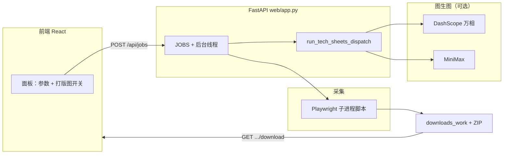

# AI 工作流说明

本文档基于当前仓库实现，概括本项目中的 **AI / 智能能力如何接入业务流程**，便于理解与扩展。

---

## 1. 总体画像

项目围绕 **便捷打板**（Supreme 等店铺高清素材采集 + **打版图 / 工艺单示意图**）搭建，AI 相关能力分为两条独立管线：

| 管线 | 入口 | 作用 |
|------|------|------|
| **打版图（图生图）** | Web：`frontend/` → FastAPI `web/app.py` | 采集完成后，可选调用云端 **图生图** API，在商品目录下生成 `tech_sheets/` |
| **多轮对话（文本 LLM）** | CLI：`main.py` + `src/memory/chat_memory.py` | 使用通义千问兼容接口做 **流式回复**、**思考过程** 与 **会话记忆**（实验 / 演示用途，不经过 Web 下载任务） |

> 说明：仓库名为 `langchainAgentDevelopment`，生产 Web 流程的核心是 Playwright 采集与云端图生图；**LangChain** 当前主要用于 `main.py` 对话示例中的 `InMemoryChatMessageHistory`（见 `src/memory/chat_memory.py`）。

---

## 2. Web 端：从下单到 ZIP 的 AI 相关流程

### 2.1 用户侧操作

1. 启动后端：`python web/app.py`（默认 `8765`）。
2. 启动前端：`frontend` 目录下 `npm run dev`（通常 `5173`，经 Vite 代理访问 `/api`）。
3. 在面板中选择：`mode`（T 恤高清 / 全部分类高清）、`max_products`、`browser_channel`，以及是否 **生成打版图**（`generate_tech_sheets`）。
4. 提交后轮询任务状态；完成后通过 `/api/jobs/{id}/download` 下载 ZIP。

前端开关含义：**关闭「生成打版图」时，后端不会调用通义万相或 MiniMax**，仅打包高清采集结果。

### 2.2 后端编排（与 AI 相关的步骤）

1. **创建任务**：`POST /api/jobs` 写入内存态 `JOBS[job_id]`，后台线程执行 `_run_hd_download`。
2. **采集**：子进程运行 `scripts/supreme_tshirts_download_hd_images.py`（Playwright），产物落在 `downloads_work/<work_folder>/<subdir>/`。
3. **打版图调度**（仅当任务记录中 `generate_tech_sheets` 为真）：`run_tech_sheets_dispatch()` 根据环境变量 **`TECH_SHEET_PROVIDER`** 选择：
   - `none` / `off`：跳过；
   - `dashscope`：通义万相（`web/qwen_wanx_i2i.py`）；
   - `minimax`：MiniMax（`web/minimax_tech_sheet.py`）；
   - `auto`（默认）：若配置了 `DASHSCOPE_API_KEY` 或 `QWEN_API_KEY` 则优先万相，否则有 `MINIMAX_API_KEY` 则走 MiniMax，都无则跳过并写日志。
4. **打包**：将输出目录打成 ZIP，任务状态为 `done`，日志中包含子进程输出与打版图步骤说明。

### 2.3 打版图 AI 的技术要点（摘要）

- **通义万相**：异步创建图生图任务 → 轮询任务状态 → 拉取结果图；可参考 `web/qwen_wanx_i2i.py` 顶部环境变量说明（模型、轮询间隔、图片压缩与尺寸约束等）。
- **MiniMax**：由 `web/minimax_tech_sheet.py` 实现，与万相通过同一调度入口互斥或按配置选择。
- **元信息**：`GET /api/meta` 返回当前是否配置了 DashScope / MiniMax Key 以及 `tech_sheet_provider`，便于前端展示预期能力。

---

## 3. CLI：文本对话与记忆（`main.py`）

独立于 Web 下载流水线，用于演示 **OpenAI 兼容协议 + 通义模型 + 多轮记忆**：

1. 使用 `DASHSCOPE_API_KEY` 与 Base URL `https://dashscope.aliyuncs.com/compatible-mode/v1` 构造客户端。
2. `stream_with_memory()` 调用 `build_messages_with_history()`，从 `src/memory/chat_memory.py` 基于 **`langchain_core`** 的 `InMemoryChatMessageHistory` 拼装消息列表（并将 `human`/`ai` 映射为 API 所需的 `user`/`assistant`）。
3. 请求参数包含 `stream=True` 与 `extra_body={"enable_thinking": True}`，分别打印思考链与正式回答；结束时 `save_to_history()` 写回会话。
4. 会话按 `session_id` 内存存储（进程内字典），适合本地实验，**非持久化数据库**。

---

## 4. 端到端数据流（Web + 打版图）

---

## 5. 关键文件索引

| 路径 | 说明 |
|------|------|
| `web/app.py` | FastAPI、作业生命周期、`run_tech_sheets_dispatch`、`/api/meta`、`/api/jobs` |
| `web/qwen_wanx_i2i.py` | 通义万相图生图（打版图） |
| `web/minimax_tech_sheet.py` | MiniMax 打版图 |
| `web/env.example` | 环境变量示例 |
| `frontend/src/App.tsx` | 下载面板与轮询、打版图开关 |
| `frontend/src/api.ts` | REST 封装 |
| `frontend/src/ai-agent-ui-spec.ts` | 前端修改约定（供自动化 / AI 辅助改 UI 时对齐） |
| `main.py` | CLI 流式对话 + 思考 |
| `src/memory/chat_memory.py` | LangChain 内存历史与消息拼装 |

---

## 6. 小结

- **业务主路径上的 AI**：云端 **图生图**，在高清图就绪后为每件商品生成打版图目录 `tech_sheets/`，与采集结果一并 ZIP 交付。
- **研发辅助路径上的 AI**：**文本大模型 + LangChain 内存**，用于对话实验与后续 Agent 能力迭代，与 Web 采集任务解耦。

若你后续把 LangChain Agent、工具调用或 RAG 接入同一仓库，建议在本文档补充新的一节「Agent 拓扑」并链到具体模块路径。
