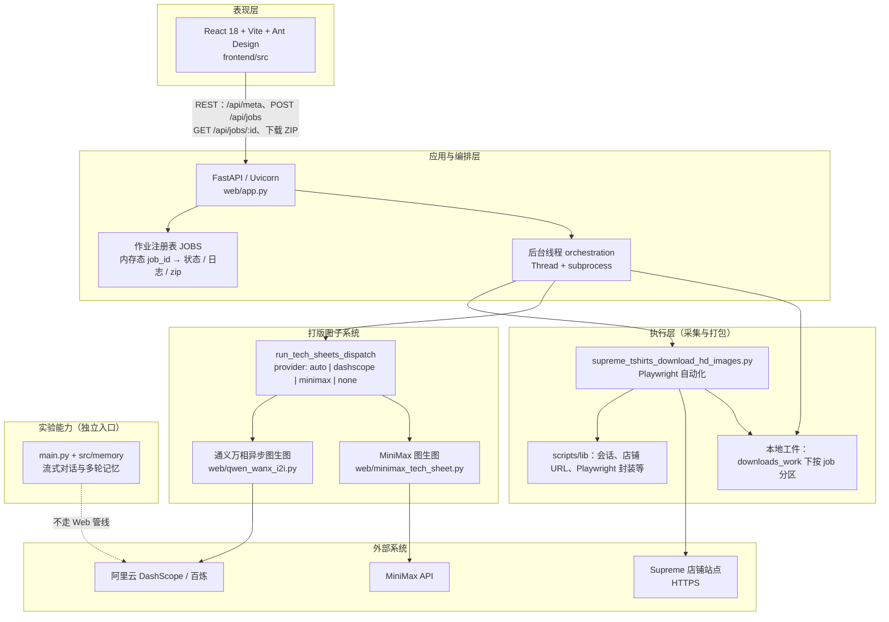
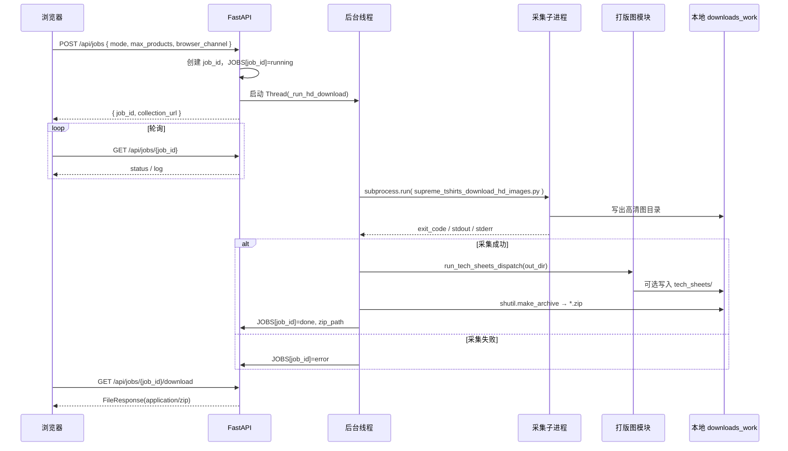

# langchainAgentDevelopment

本项目围绕 **便捷打板** 搭建：把 Supreme 等店铺商品的高清素材采集、整理与 **打版图（工艺单示意图）** 生成串成一条可走通的工作流，减少手工截图、整理与反复沟通成本。

## 目标与能力概览

- **打板导向**：下载任务完成后，可在商品图目录下生成 `tech_sheets/`，并与高清图一并打包；打版图支持通过环境变量选用 **通义万相**（DashScope）或 **MiniMax** 等图生图服务（详见 `web/app.py` 顶部说明与 `web/env.example`）。

- **Web 控制台**：`frontend/` 为 React（Vite + Ant Design）界面，调用后端 API 发起采集任务、查看日志与下载 ZIP。

- **后端 API**：`web/app.py`（FastAPI）驱动 Playwright 自动化拉取高清图、协调打版图生成；默认端口 `8765`，可与前端代理联动。

- **自动化脚本**：`scripts/` 内含 Supreme 店铺相关 Playwright 封装、截图与高清图下载等工具模块（`scripts/lib/`），便于扩展其它采集或批处理场景。

- **对话与记忆示例**：根目录 `main.py` 使用通义千问兼容接口与 `src/memory/` 中的记忆拼装，演示流式输出与多轮上下文（便于 Agent / 对话类能力迭代）。

## 技术方案与架构

### 总体思路

采用 **前后端分离 + 异步长任务 + 子进程隔离采集** 的形态：浏览器端仅负责编排与状态展示；采集与 IO 密集逻辑放在独立 Python 子进程中执行，避免阻塞 ASGI 事件循环；打版图生成按 `TECH_SHEET_PROVIDER` 路由至云端图生图 API。作业状态当前保存在进程内字典 `JOBS`（适合单机开发/内网工具场景）。

### 逻辑架构（分层与外部依赖）

### 异步作业与交付物数据流

### 关键技术选型摘要

| 维度 | 选型 | 说明 |

|------|------|------|

| 前端运行时 | React 18 + TypeScript + Vite | 开发与构建；生产可静态部署并与 `VITE_API_BASE` 指向后端 |

| 后端运行时 | FastAPI + Uvicorn | OpenAPI 文档 `/docs`；CORS 限定本地前端来源 |

| 长任务模型 | 线程 + 子进程 | 线程承载阻塞式 `subprocess.run`；与 Playwright 进程边界清晰 |

| 采集引擎 | Playwright（Chromium/Chrome/Edge） | 由 `browser_channel` 选择通道 |

| 打版图 | DashScope Wanx / MiniMax | 由环境变量与 `TECH_SHEET_PROVIDER` 组合决策 |

| 实验对话 | OpenAI 兼容 Base URL + 通义模型 | `main.py` 演示记忆拼装与流式输出 |

## 快速上手（摘录）

- **后端**：`pip install -r requirements-web.txt`，在项目根目录执行 `python web/app.py`。

- **前端**：进入 `frontend/`，`npm install` 后 `npm run dev`；若后端端口非默认，按 `web/app.py` 注释配置 `frontend/.env.local` 中的代理目标。

更细的依赖、环境变量与端口说明见 `web/app.py` 文件头注释。

